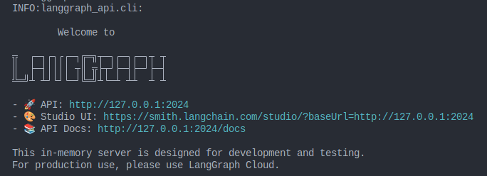
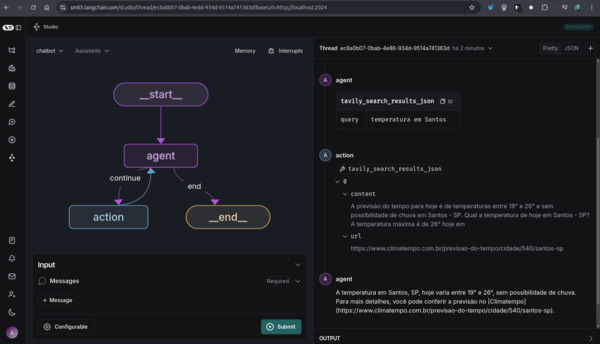

# LangGraph Studio 

This project involves implementing LangGraph Studio, a tool designed to enhance the development experience for [LangGraph](https://www.langchain.com/langgraph) applications. LangGraph Studio serves as an interactive agent IDE, enabling developers to visualize, interact, and debug their LangGraph workflows seamlessly. In this implementation, I used Ubuntu Linux.


### Application Structure

```
my-app/
├── my_agent # all project code lies within here
│   ├── utils # utilities for your graph
│   │   ├── __init__.py
│   │   ├── tools.py # tools for your graph
│   │   ├── nodes.py # node functions for you graph
│   │   └── state.py # state definition of your graph
│   ├── requirements.txt # package dependencies
│   ├── __init__.py
│   └── agent.py # code for constructing your graph
├── .env # environment variables
└── langgraph.json # configuration file for LangGraph
```


### Prerequisites  

Ensure you have the following installed and set up before proceeding:  
- Python 3.11  
- API keys for .env: OpenAI, Anthropic, Tavily


## Project Setup Guide

### Clone the Repository
```
$ git clone git@github.com:luizweb/langgraph-studio.git
$ cd langgraph-studio
```

### Create Virtual Environment
```
$ virtualenv .venv
$ source .venv/bin/activate
```


### Install dependencies and Langgraph CLI (with inmem extras)
```
$ pip install -r ./my_agent/requirements.txt
$ pip install "langgraph-cli[inmem]==0.1.55"
```


### PYTHONPATH Configuration
Adds the current directory to the Python module search path, enabling Python to import modules from the present working directory alongside system-wide Python paths:
```
$ export PYTHONPATH=$(pwd):$PYTHONPATH
```


### Start Local Development Server
```
$ langgraph dev
```




### Running

*I needed to replace the default ip 127.0.0.1 in the address to 'localhost'*
https://smith.langchain.com/studio/thread?baseUrl=http://localhost:2024




### Reference
- [Youtube - LangChain](https://youtu.be/o9CT5ohRHzY?si=YMmxo2E5pPYfufxx)
- [LangGraph - Application Structure](https://langchain-ai.github.io/langgraph/concepts/application_structure/#related)
- [Langgraph - How tos - Local Studio](https://langchain-ai.github.io/langgraph/how-tos/local-studio/#use-the-studio)
- [Langgraph - How tos](https://langchain-ai.github.io/langgraph/how-tos/)
